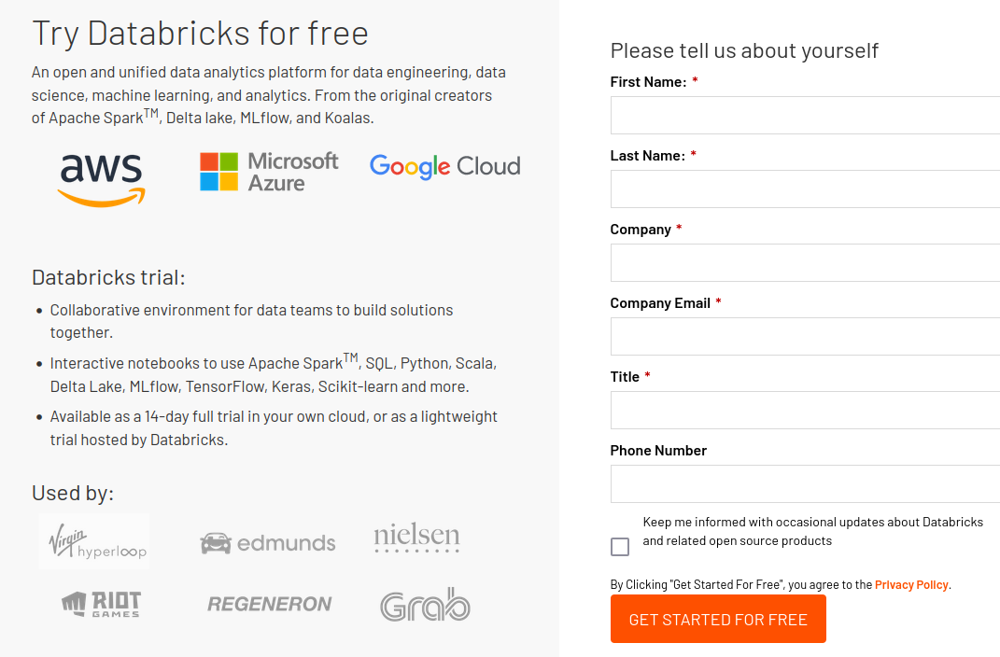
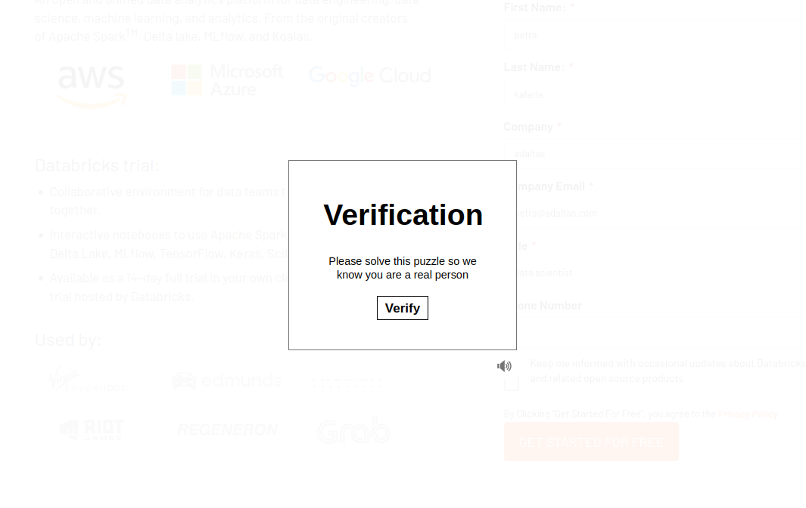
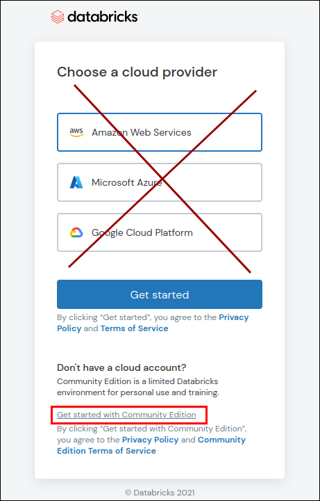
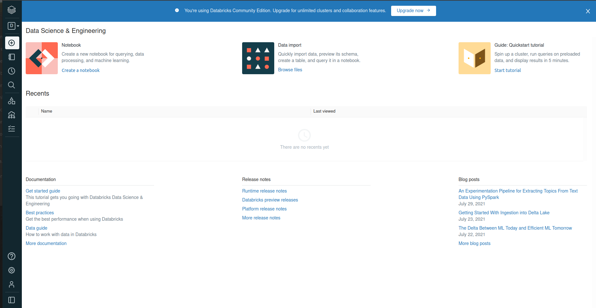
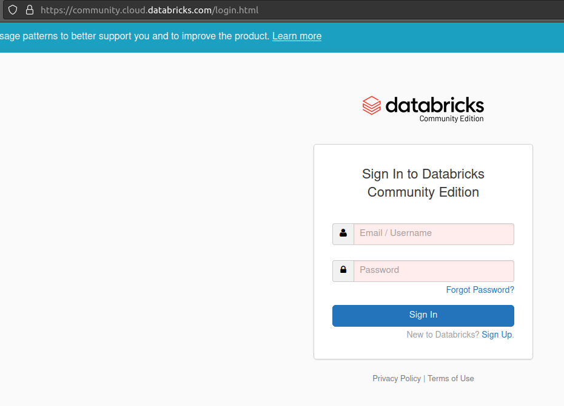

# Connection to Databricks Community Edition

During the labs, we will be using the free Databricks platform, called Community Edition.
Before using it, you need to create an account.

**NOTE:** Databricks offer two trial versions of their platform:
- Community Edition: unlimited time, limited functionality. Hosted on AWS (you don't need to select it yourself).
- Free Trial: 14 days of all functionalities. You can choose the cloud provider. Databricks' service is free, but other resources (VM, storage...) is charged by the cloud provider.

**Pay attention to sign up for Community Edition.** It should never ask you for your credit card details.

## 1. Create an account

Go to the following link: https://databricks.com/try-databricks.

Fill in the form and click `GET STARTED FOR FREE`

This will bring you to a site with a puzzle. Sometimes it takes a lot of patience ;)

Next step is **very important**. When you have the list of the **cloud providers**,
**don't choose any of them**. Instead, click on the **link below** `Get started with Community Edition`.

Now, you should received **an email** with further instructions.

At the end, you should end up in your Databricks **workspace**.

## 2. Connect to the existing account

Go to the following link https://community.cloud.databricks.com/login.html and **sign in**.

You should end up in your Databricks **workspace**.

