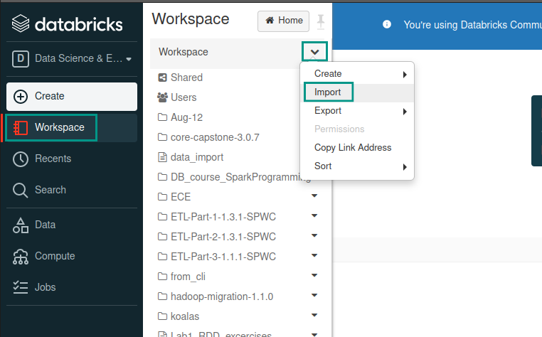

# Import notebooks and data to Databricks Workspace

During the lab you will need to import the prepared notebooks and maybe also some detasets. Here you will learn how.

## Import a notebook

When you are in your workspace, click on `Workspace` in the sidebar on the left, then on `v` in the pop-up menu and then on `Import`. All steps are shown below.

You can import a notebook as a file or with copy-pasting a link (this doesn't always work).

## Execute the code

You have opened notebook, but no clusters running. If you want to execute the code, you need to start a cluster and attach the notebook to it. You can see if the notebook is attached or not just below the title of the notebook.

The easiest way to start the cluster and attach the notebook is the following. Go to the first cell with the code and execute it pressing `Shift+Enter` or clicking on the `play icon` in the upper right corner of the cell. You should see the following message.

Click `Launch and Run`. After a while, the `Detached` state will be replaced by a green dot and a cluster name, which indicates that the notebook is attached. Also, the execution details will show up at the bottom of the executed cell.

## Import a dataset

To import a dataset, you need an active cluster. The easiest way is to open a notebook and run a cell, as described above.

Click on `Data` in the sidebar on the left and then the icon `Create Table` in the upper right corner.

Select your data source and follow the instructions. If you are uploading file from your drive, click `Upload File` and then click the gray surface, to activate the upload interface.

