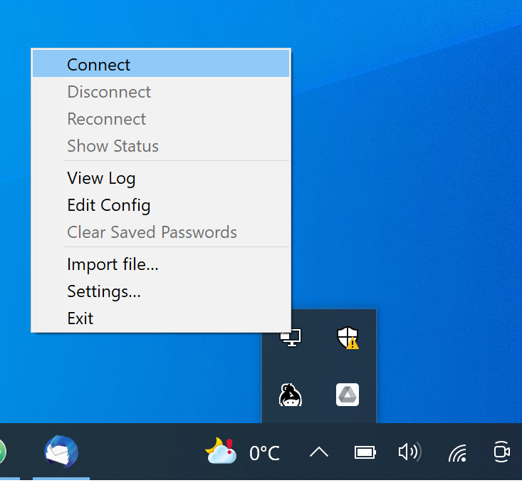
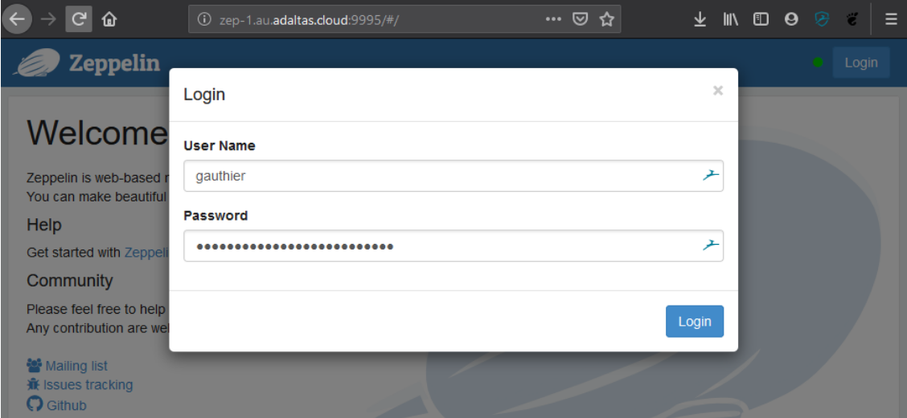
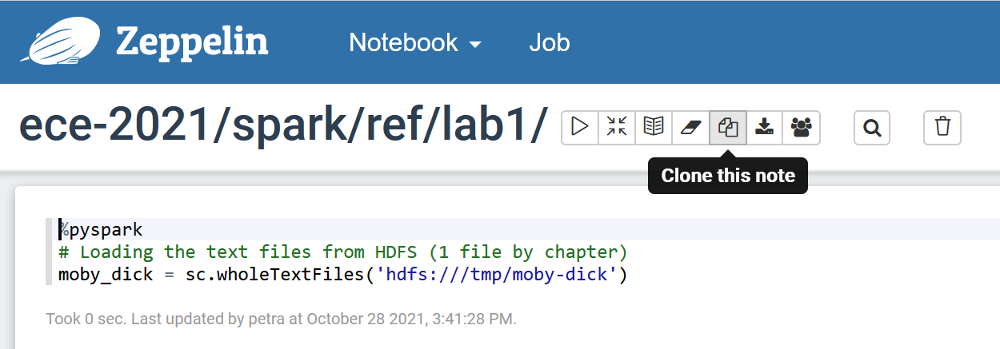
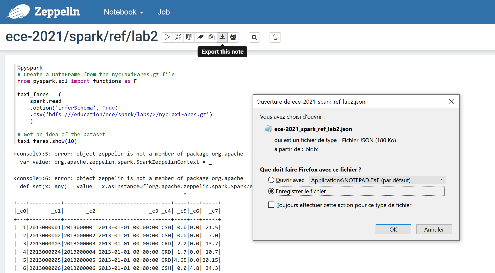
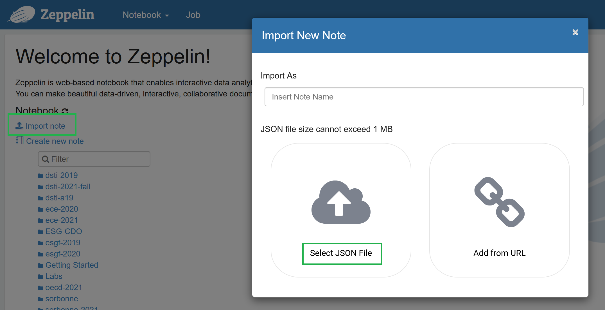
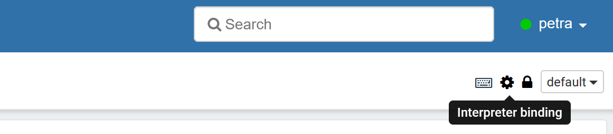
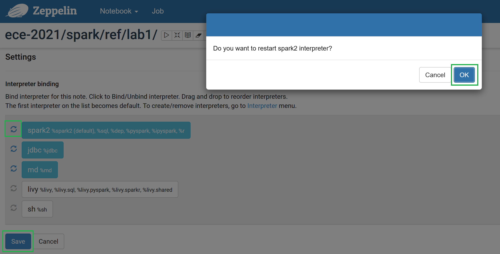

# Connection to Zeppelin notebooks on Adaltas Hadoop cluster and code execution

## Connect to the Zeppelin

- Connect to the Adaltas cloud cluster using OpenVPN

- Navigate to http://zep-1.au.adaltas.cloud:9995 with your browser
- Login using your Adaltas cloud credentials

## Working with notebooks

- Once connected, you can create notebooks in the dedicated folder (read lab instructions for the details). Go to the folder name and click `+` (Create new note).

- If you need to copy an existing notebook, first open the required notebook and then click on the icon `Copy` (Clone this note).

- If needed, you can set up permissions by clicking `Lock icon` (Note permissions) in the upper right corner.

- Initialize your interpreter by running the first cell. If you are starting from a new notebook, you need to specify the interpreter in the first line of the cell (e.g. `%pyspark`, as shown on the image for cloning a notebook).

## Downloading and uploading the notebook

To **download** the notebook, click on the following icon. It will be downloaded as .json file.

To **upload** the notebook, click on `Import note` on the welcome page and then select the correct .json file. **Note:** The notebook will get uploaded to the same location as it was downloaded from, but as a new copy with the same name.

## Troubleshooting

Sometimes technical issues might arise. One example is `BROKEN PIPELINE error`. Some of the problems can be resolved by restarting the interpreter.

- First, click on the `Gear icon` (Interpreter binding).

- Click on the arrows next to the `spark2` interpreter. You will get a message to confirm the restart. If this message doesn't appear or the interpreter doesn't get restarted, repeat until it does. Afterwards, click `Save`.

**However, don't blame the technical issues for every error you get.** Syntax errors will not be solved by restarting the interpreter ;)
