# Spark Structured Streaming

## What is streaming data?

- Continuously generated data
- Coming from many data sources simultaneously
- Small in size (kB range)
- Examples: IoT, stock market, recommendation based on geo-location, electricity consumption...

## Difference between batch and stream processing

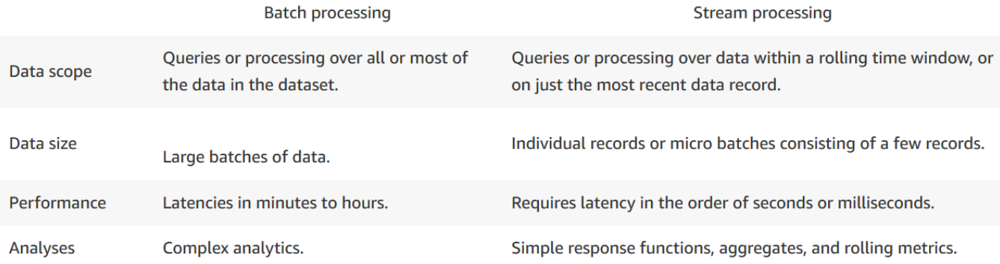

## Streaming

- Unbounded data sets (in opposition to finite data sets)
- Unbounded data processing (in time)
- Spark Structured Streaming: fault-tolerant exactly-once processing

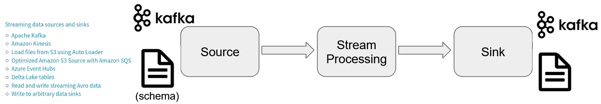

## Stream processing models

- Traditional model:

  (-) redundancy
  (+) latency (ms)

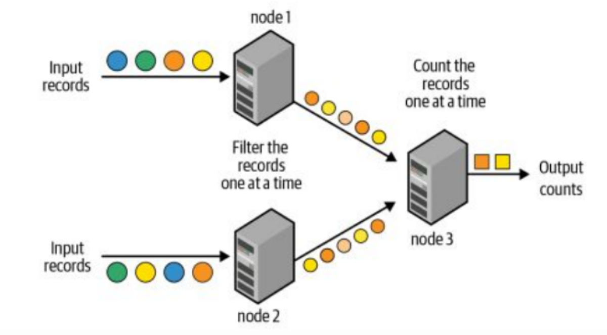

- Micro-batch model:

  (+) redundancy
  (-) latency (100 ms: exactly-once semantics)

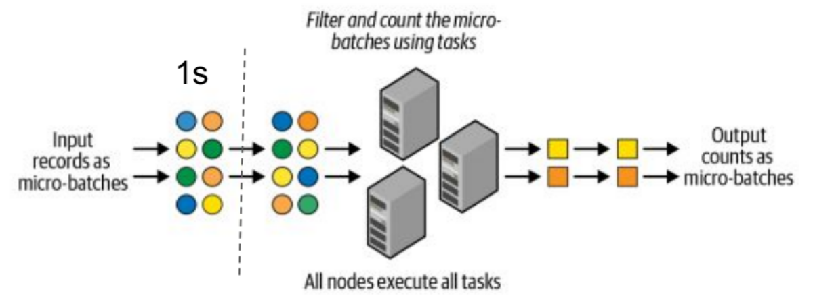

## Different processing semantics

- At-most-once

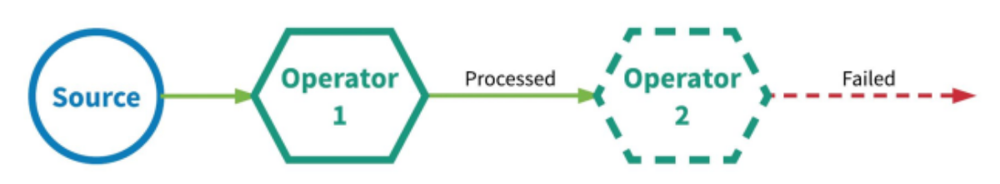

- At-least-once

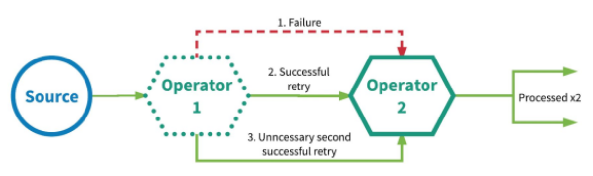

- Exactly-once

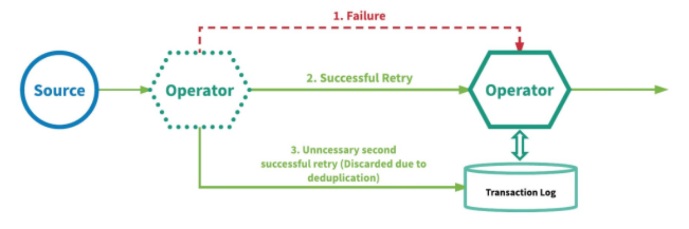

[Resource](https://www.splunk.com/en_us/blog/it/exactly-once-is-not-exactly-the-same.html)

## Programming model

Streaming computation as standard batch-like query:

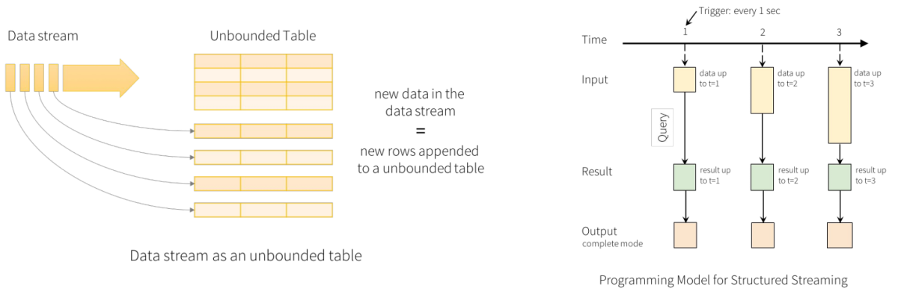

Output modes:

- **Complete** - writes all the rows of a result table
- **Append** - writes "new" rows only
- **Update** - writes only the rows that were updated

### Example: Word count

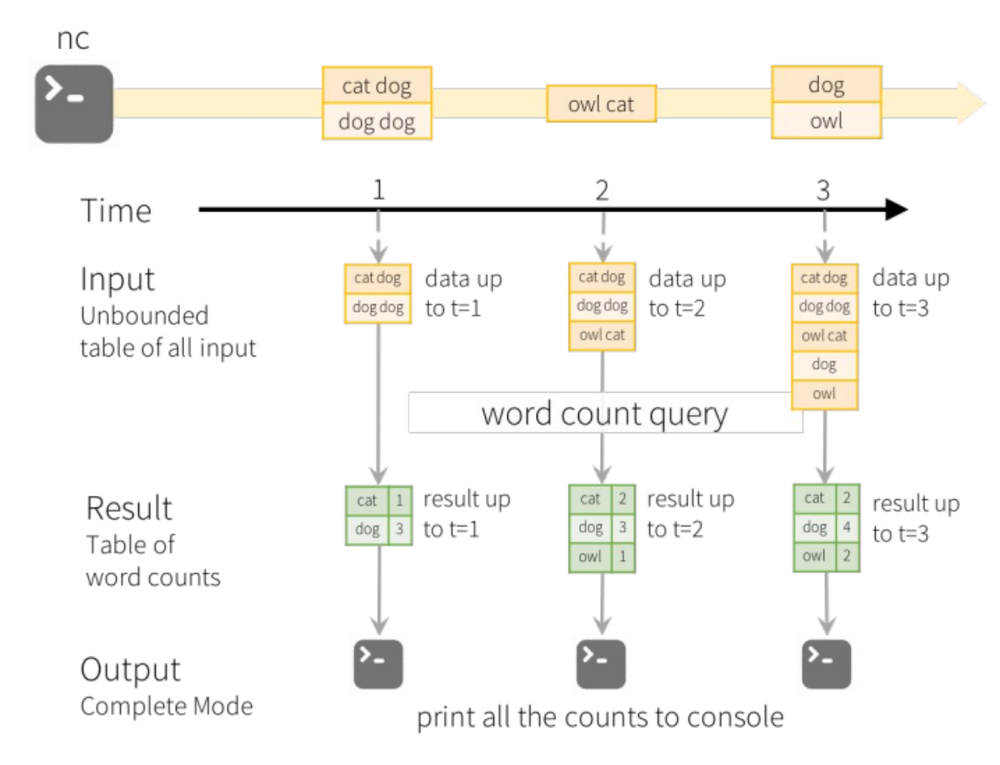

## Operations on Streaming DataFrames

The syntax is very similar than what we saw with static DataFrames:

```python
# Streaming DataFrame with IoT device data with schema { device: string, deviceType: string, signal: double, time: DateType}
df = ...

# Select the devices which have signal more than 10
df.select("device").where("signal > 10")

# Running count of the number of updates for each device type
df.groupBy("deviceType").count()
```

SQL-like operations:

```python
df.createOrReplaceTempView("updates")
spark.sql("select count(*) from updates") # returns another streaming DF
```

Several operations are **not supported**: distinct, take(n), limit, chained aggregations, some types of joins...

## Event-time vs. processing time

- **event time** - when the data was generated
- **processing time** - when Spark received the data


## Windows: tumbling, overlapping

Each event belongs to one window or more

#### Example: Aggregation over a sliding event-time window

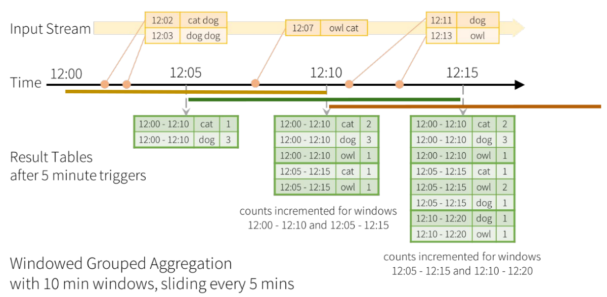

## Handling late data: how long to wait?

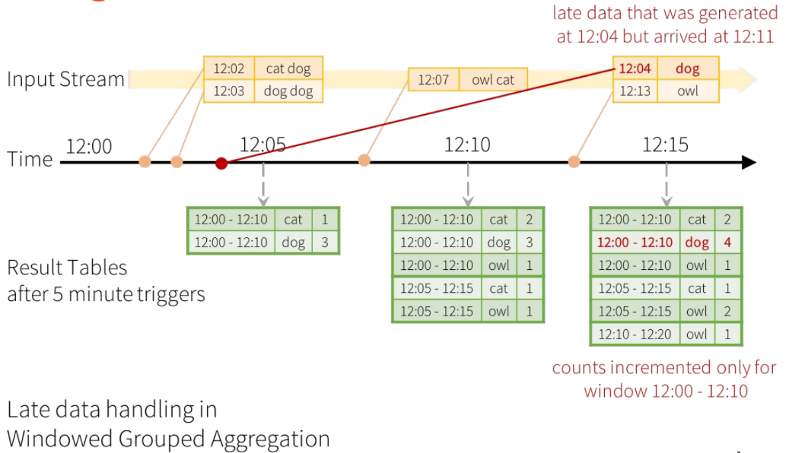

### Watermarking

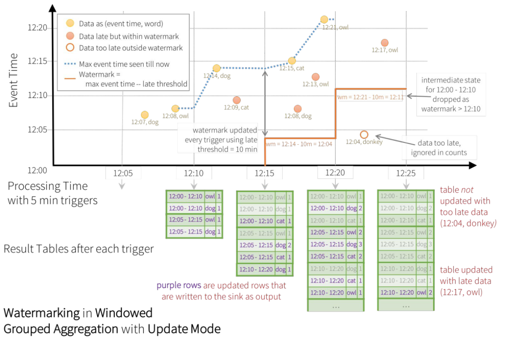

## Vocabulary

- **Event-time** - a time when the event happens
- **Processing time** - a time when we receive the data of the event
- **Trigger** - how often we will collect the data
- **Window** - for how long will we collect the data
- **Watermark** - when the late data is discarded (how late is too late)
